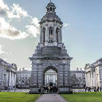
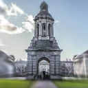
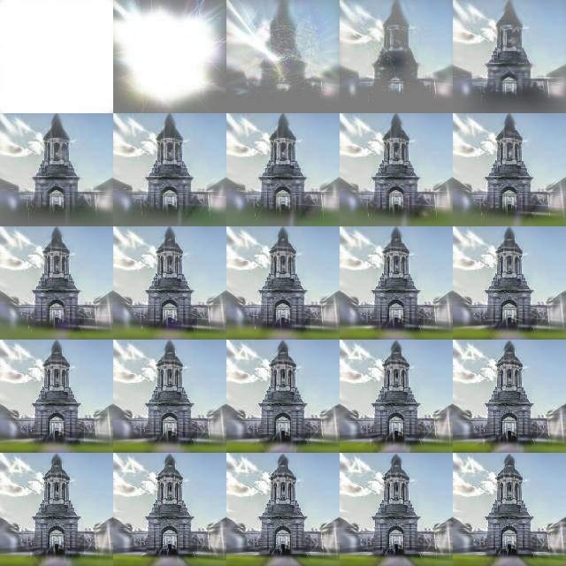

# 2d Image reconstruction using Gaussians
(based on 3d gaussian splatting - https://repo-sam.inria.fr/fungraph/3d-gaussian-splatting/)

This project aims to reconstruct a 2D image using 2d Gaussians.

Original Image



Reconstructed Image (using 1500 gaussians)



Optimization Progress




## Overview

### GaussianRenderer2D

This class renders 2D Gaussian distributions onto a plane. The class defines a grid of pixel coordinates, which are used to compute the values of the Gaussian distributions at each pixel. It also computes the covariance matrix from theta and scale. The computed gaussians are added together based on the learned alpha blending parameters

### GaussianImage

This class represents an image as a mixture of Gaussians. It defines five trainable parameters - means, rgb, alpha, theta, and scale of the Gaussians, as well as their RGB color values.

### Scope for improvement

There is definitely scope for improvement here. The edges of the image are not getting reconstructed sharply. Secondly, none of the optimization strategies used in the original paper are implemented here.

## Usage

To run the script,  run the `2d_splatter.py` script.

```sh
python 2d_splatter.py
```

 